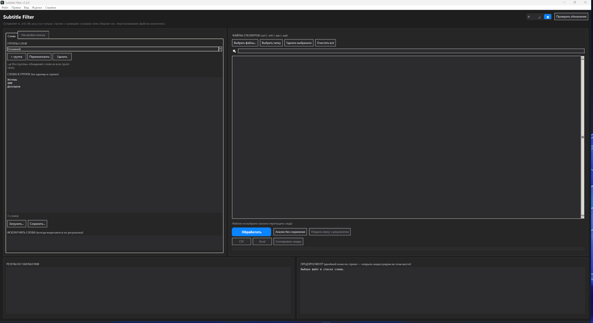
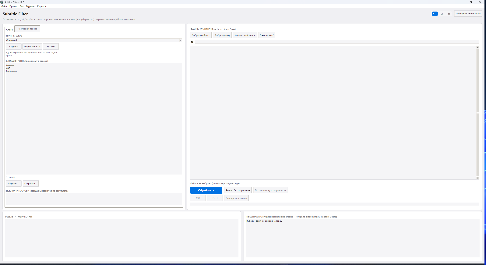
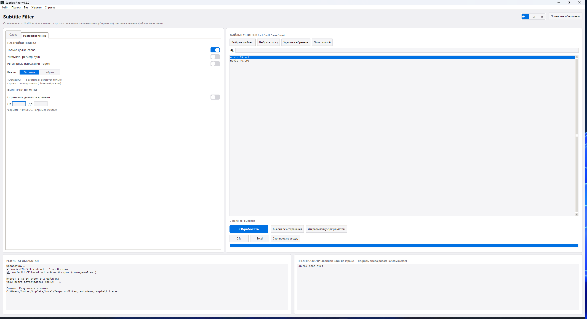
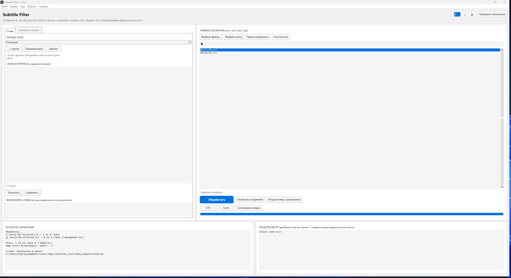

<div align="center">


# Subtitle Filter

**Оставляет в субтитрах только то, что важно.**

[](../../releases/latest)
[](#требования)
[](#для-разработчиков)
[](#как-скачать)

Программа для Windows, которая находит в `.srt` / `.vtt` / `.ass` / `.ssa`
файлах строки с нужными словами и убирает всё остальное — так можно за
секунды найти в видео нужные моменты, вместо того чтобы вручную
пролистывать десятки минут субтитров.

[Скачать](#как-скачать) · [Возможности](#возможности) · [Скриншоты](#скриншоты) · [Как пользоваться](#как-пользоваться) · [Для разработчиков](#для-разработчиков)

</div>

---

## Скриншоты

<table>
<tr>
<td width="50%">

**Тёмная тема**


</td>
<td width="50%">

**Светлая тема**


</td>
</tr>
<tr>
<td width="50%">

**Настройки поиска** — целые слова, regex, режим «оставить/убрать», фильтр по времени


</td>
<td width="50%">

**Результат обработки** — сводка по строкам и файлам сразу после запуска


</td>
</tr>
</table>

---

## Возможности

| | |
|---|---|
| 🔍 **Поиск по списку слов** | Просто список — по одному слову или фразе на строку |
| 🗂 **Группы слов** | Несколько именованных списков сразу (например «имена», «жёсткое») + режим «все группы» |
| 🎬 **Своя группа для файла** | Правый клик по файлу — можно назначить ему отдельную группу слов, отличную от общей |
| 🚫 **Список исключений** | Слова, которые нужно вырезать всегда, независимо от режима и группы |
| ⏱ **Фильтр по времени** | Можно ограничить обработку диапазоном времени ролика (например, только первые 5 минут) |
| 🔤 **Регистр не важен** | «Папа», «ПАПА» и «папа» — одно и то же (можно включить учёт регистра) |
| 🎯 **Целые слова / часть слова** | Переключается тумблером — «рот» не подхватит «ворота», если не нужно |
| 🧩 **Regex-режим** | Каждая строка списка слов — регулярное выражение, для сложного поиска |
| ↔️ **Оставить / убрать** | Можно не только оставлять строки с совпадениями, но и наоборот — вырезать их, оставив остальное |
| 📁 **Пачками** | Можно выбрать сразу папку или перетащить файлы — обработает всё разом |
| 🔎 **Поиск по списку файлов** | Быстро находит нужный файл в длинном списке; лишние файлы легко убрать из списка |
| 👁 **Предпросмотр** | Видно, что найдётся, ещё до сохранения — с подсветкой найденного слова |
| 🎥 **Открыть видео по клику** | Двойной клик по строке в предпросмотре — открывает видео с таким же именем рядом (через VLC — сразу на нужной секунде) |
| 🧮 **Анализ без сохранения** | Посмотреть, сколько совпадёт, не создавая файлов |
| 📊 **Прогресс и итоги** | Индикатор прогресса и общая сводка по всем файлам после обработки |
| 📈 **Отчёт CSV / Excel** | Сколько раз какое слово встретилось — включая отчёт по всем группам сразу и график в Excel |
| 🕘 **История обработок** | Последние запуски — когда, сколько файлов, какой режим — с быстрым переходом к результату |
| 🧰 **Профили настроек** | Сохранить/загрузить целиком набор: группы, режим, исключения, regex — под конкретную задачу |
| 🌗 **Светлая / тёмная / системная тема** | Интерфейс в духе macOS — три варианта темы, включая автоопределение по теме Windows |
| ⌨️ **Горячие клавиши и меню** | Ctrl+O, Ctrl+Shift+O, Ctrl+Enter, Ctrl+S, Ctrl+D, Ctrl+Shift+A — и обычное меню сверху |
| 🖧 **Режим командной строки** | Пакетная обработка без интерфейса — удобно для своих скриптов (см. «Для разработчиков») |
| 💾 **Всё запоминается** | Список слов, папка, тема и все настройки сохраняются между запусками |
| 🔔 **Проверка обновлений** | Кнопка в шапке — сверяется с GitHub Releases, умеет скачать и установить новую версию сама |
| 🖥 **Просто .exe** | Не требует установки Python |

---

## Формат субтитров

Поддерживаются `.srt`, `.vtt`, `.ass` и `.ssa` (например, субтитры из
YouTube, Whisper или сделанные в Aegisub). Таймкоды и оформление (стили,
теги) не трогаются — файл сразу открывается в плеере на нужном месте.

---

## Как скачать

1. Перейди во вкладку **[Releases](../../releases)**.
2. Скачай `SubtitleFilter.exe` из раздела Assets последнего релиза.
3. Больше ничего не нужно — файл самостоятельный, установка не требуется.

> Windows может показать предупреждение SmartScreen, потому что файл не
> подписан цифровой подписью издателя — это нормально для независимо
> собранных программ. Нажми **«Подробнее» → «Выполнить в любом случае»**.
>
> Если публикуешь релиз — рекомендуется приложить в описании SHA256-хеш
> файла, чтобы люди могли проверить, что скачали именно то, что ты собрал.
> Посчитать его можно в PowerShell: `Get-FileHash SubtitleFilter.exe`.

---

## Как пользоваться

1. Запусти `SubtitleFilter.exe`.
2. Слева выбери или создай группу слов, впиши нужные слова (по одному на строку).
3. Справа выбери файлы, папку — или просто перетащи `.srt`/`.vtt` в окно.
   Список можно отфильтровать полем поиска, а лишние файлы — убрать кнопкой
   «Удалить выбранное» (или клавишей Delete).
4. Кликни на файл в списке — справа снизу сразу увидишь предпросмотр с
   подсветкой найденных слов, ещё до сохранения.
5. Настрой поиск слева: целые слова, регистр, обычный текст или regex,
   и режим — **«Оставить»** совпадения (обычный режим) или **«Убрать»**
   их, оставив всё остальное.
6. Нажми **«Обработать»** — готовые файлы появятся в подпапке `filtered`
   (или `filtered`/`*.cleaned.*` в режиме «Убрать»), с прогрессом и общей
   сводкой по всем файлам.
7. При желании — **«Экспорт отчёта (CSV)»**: сколько раз какое слово нашлось.

Тему (светлая/тёмная/системная), список слов, последнюю папку и все
настройки можно переключать переключателем в шапке или через меню «Вид» —
они сохраняются автоматически в `%APPDATA%\SubtitleFilter\settings.json`,
при следующем запуске всё будет как было (обновление программы больше не
затирает настройки, даже если exe лежит в новой папке).

### Горячие клавиши

| Клавиши | Действие |
|---|---|
| `Ctrl+O` | Выбрать файлы |
| `Ctrl+Shift+O` | Выбрать папку |
| `Ctrl+Enter` | Обработать |
| `Ctrl+Shift+A` | Анализ без сохранения |
| `Ctrl+S` | Сохранить группу слов в файл |
| `Ctrl+D` | Переключить тему (светлая → тёмная → системная) |
| `Delete` | Удалить выбранные файлы из списка |
| `Ctrl+Q` | Выход |

### Дополнительные возможности

- **Своя группа слов для конкретного файла** — правый клик по файлу (или
  нескольким выбранным) → «Назначить группу для выбранных...». В списке
  файл будет показан с пометкой `→ группа`.
- **Список исключений** — слова во вкладке «Слова» под общим списком:
  строки с этими словами вырезаются всегда, даже в режиме «Оставить».
- **Фильтр по времени** — во вкладке «Настройки поиска»: включи тумблер и
  укажи «От»/«До» в формате `ЧЧ:ММ:СС`, чтобы обработка учитывала только
  этот отрезок ролика.
- **Профили** — меню «Правка → Профили»: сохраняет текущие группы, режим,
  исключения и настройки поиска одним именем, чтобы быстро переключаться
  между разными задачами (например, «мат» и «имена персонажей»).
- **История** — меню «Журнал → История обработок»: список прошлых запусков
  с датой, количеством файлов и результатом; двойной клик открывает папку
  с результатом.
- **Экспорт по всем группам** — меню «Файл → Отчёт по всем группам...»:
  считает совпадения сразу для каждой группы слов, а не только активной.

---

## Требования

- Windows 10 / 11
- Ничего дополнительно устанавливать не нужно (drag-and-drop работает из коробки,
  если exe собран с `tkinterdnd2` — см. ниже)

---

## Для разработчиков

<details>
<summary><strong>Развернуть</strong> — запуск из исходников, CLI-режим, сборка .exe, релизы</summary>

Исходный код — `subtitle_filter_app.py` (Python, tkinter).

### Запуск без сборки

```bash
pip install tkinterdnd2 openpyxl
python subtitle_filter_app.py
```

`tkinterdnd2` нужен только для перетаскивания файлов мышкой, `openpyxl` —
только для экспорта отчёта в Excel. Без них программа тоже полностью
работает: перетаскивание заменяется кнопками выбора файлов, а вместо
Excel остаётся экспорт в CSV.

### Режим командной строки (без интерфейса)

```bash
python subtitle_filter_app.py --cli --keywords keywords.txt --input subs_folder --mode remove --whole-word --out out_folder
```

Полный список параметров: `python subtitle_filter_app.py --cli --help`.
Удобно для пакетной обработки из своих скриптов или по расписанию —
собранный `.exe` тоже поддерживает `--cli` точно так же.

### Сборка .exe

```bash
pip install pyinstaller tkinterdnd2 openpyxl
pyinstaller --onefile --windowed --name "SubtitleFilter" --icon "app_icon.ico" --collect-all tkinterdnd2 subtitle_filter_app.py
```

Флаг `--collect-all tkinterdnd2` обязателен, если хочешь, чтобы
перетаскивание файлов работало и в собранном `.exe` — эта библиотека
подключает нативные бинарники, которые PyInstaller сам не подхватывает.

Готовый файл: `dist/SubtitleFilter.exe`.

### Автоматическая сборка релиза (GitHub Actions)

При пуше тега вида `vX.Y.Z` workflow `.github/workflows/release.yml`
сам собирает `SubtitleFilter.exe` на `windows-latest` и публикует релиз
с этим файлом — вручную собирать и заливать exe больше не обязательно,
достаточно создать и запушить тег:

```bash
git tag v1.2.0
git push origin v1.2.0
```

### Версионирование

Текущая версия зашита в `APP_VERSION` в начале `subtitle_filter_app.py`.
При выпуске новой версии — обнови эту константу и создай тег релиза на
GitHub в том же формате (например `v1.2.0`), тогда кнопка «Проверить
обновления» в программе будет работать корректно (а сборка запустится
автоматически, см. выше).

### Структура проекта

```
subtitle-filter/
├── subtitle_filter_app.py       # исходный код программы
├── app_icon.ico                  # иконка для сборки .exe
├── docs/                          # логотип и скриншоты для README
├── README.md                      # этот файл
├── keywords-example.txt           # пример списка слов
├── .github/workflows/release.yml  # автосборка .exe и релиз по тегу vX.Y.Z
└── .gitignore
```

</details>

---

<div align="center">

Если пригодилось — оставь ⭐ репозиторию, это ни к чему не обязывает, но приятно.

</div>
