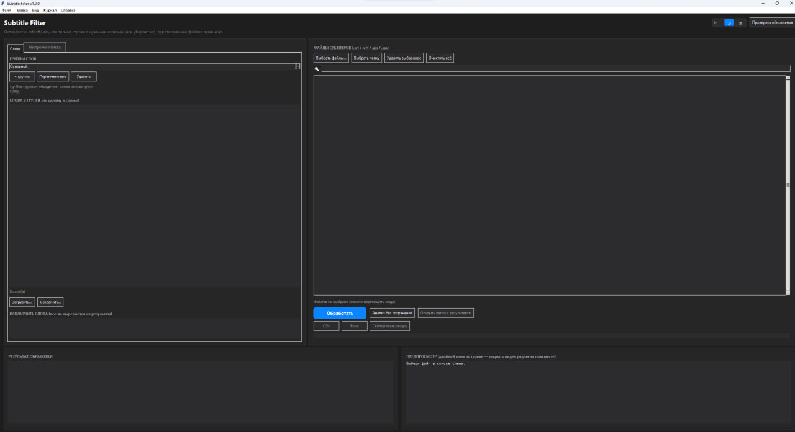
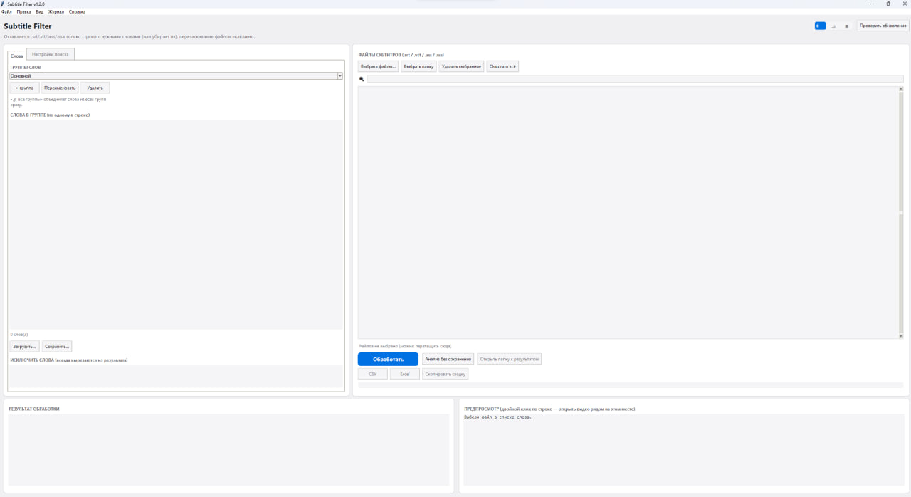
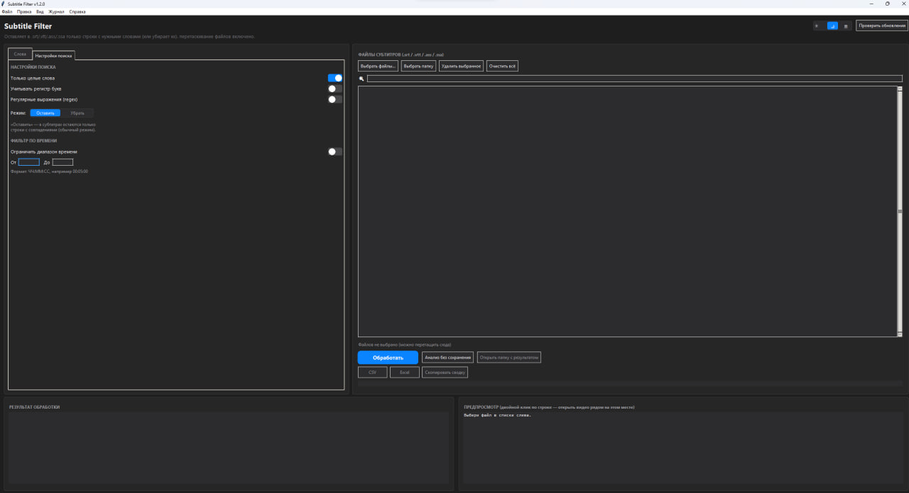
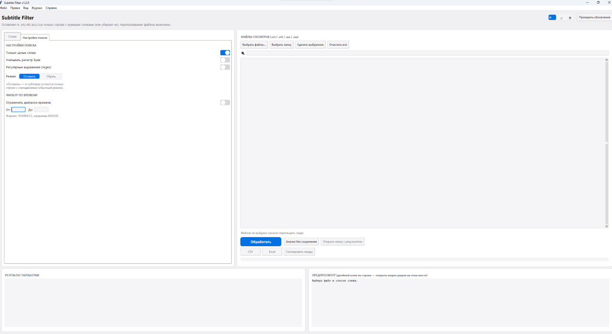

<div align="center">


# Subtitle Filter

**Keeps only the subtitle lines that matter. / Оставляет в субтитрах только то, что важно.**

[](../../releases/latest)
[](#requirements)
[](#for-developers)
[](#how-to-download)
[](LICENSE)

A Windows app that finds the lines you care about in `.srt` / `.vtt` /
`.ass` / `.ssa` subtitle files and strips out everything else — find
the moments you need in a video in seconds, instead of scrubbing
through minutes of subtitles by hand.

**[🇬🇧 English](#-english)** · **[🇷🇺 Русский](#-русский)**

</div>

---

## 🇬🇧 English

### Screenshots

<table>
<tr>
<td width="50%">

**Dark theme**


</td>
<td width="50%">

**Light theme**


</td>
</tr>
<tr>
<td width="50%">

**Search settings** (dark) — whole words, regex, keep/remove mode, time-range filter


</td>
<td width="50%">

**Search settings** (light)


</td>
</tr>
</table>

---

### Features

| | |
|---|---|
| 🔍 **Keyword list search** | Just a list — one word or phrase per line |
| 🗂 **Word groups** | Several named lists at once (e.g. "names", "profanity") + an "all groups" mode |
| 🎬 **Per-file group override** | Right-click a file to assign it its own word group, different from the default |
| 🚫 **Exclusion list** | Words that always get cut, regardless of mode or group |
| ⏱ **Time-range filter** | Limit processing to a time range of the video (e.g. only the first 5 minutes) |
| 🔤 **Case-insensitive** | "Word", "WORD" and "word" are the same (case-sensitive mode available) |
| 🎯 **Whole word / substring** | Toggle it — "cat" won't match "category" unless you want it to |
| 🧩 **Regex mode** | Every line in the word list becomes a regular expression, for advanced search |
| ↔️ **Keep / Remove** | Keep only matching lines, or flip it — cut matching lines and keep the rest |
| 📁 **Batch processing** | Pick a whole folder or drag-and-drop files — processes everything at once |
| 🔎 **File-list search** | Quickly find a file in a long list; drop the ones you don't need |
| 👁 **Live preview** | See what will match before you save anything, with matches highlighted |
| 🎥 **Open video on click** | Double-click a preview line to open the matching video next to it (via VLC — jumps straight to that second) |
| 🧮 **Dry-run analysis** | See how many matches you'd get without creating any files |
| 📊 **Progress and summary** | Progress bar plus an overall summary once every file is processed |
| 📈 **CSV / Excel report** | How many times each word matched — including a per-group report and an Excel chart |
| 🕘 **Run history** | Recent runs — when, how many files, which mode — with a quick jump to the result |
| 🧰 **Setting profiles** | Save/load a whole configuration at once: groups, mode, exclusions, regex — per task |
| 🌗 **Light / dark / system theme** | macOS-style UI with three theme options, including following Windows' theme |
| ⌨️ **Hotkeys and menu** | Ctrl+O, Ctrl+Shift+O, Ctrl+Enter, Ctrl+S, Ctrl+D, Ctrl+Shift+A — plus a regular top menu |
| 🖧 **Command-line mode** | Headless batch processing — handy for your own scripts (see "For developers") |
| 💾 **Everything is remembered** | Word lists, folder, theme and all settings persist between runs |
| 🔔 **Update check** | A button in the header checks GitHub Releases and can download & install updates itself |
| 🖥 **Just an .exe** | No Python installation required |
| 🌐 **English / Русский** | Full interface toggle (View menu) — restart to apply |

---

### Subtitle formats

`.srt`, `.vtt`, `.ass` and `.ssa` are supported (e.g. subtitles from
YouTube, Whisper, or made in Aegisub). Timecodes and styling (tags,
styles) are left untouched — the file opens right at the matched spot
in your player.

---

### How to download

1. Go to the **[Releases](../../releases)** tab.
2. Download `SubtitleFilter.exe` from the Assets of the latest release.
3. That's it — it's a single self-contained file, no installation needed.

> Windows may show a SmartScreen warning because the file isn't signed
> with a publisher certificate — that's normal for independently built
> apps. Click **"More info" → "Run anyway"**.
>
> If you're publishing a release yourself, it's a good idea to include
> the file's SHA256 hash in the release notes, so people can verify
> what they downloaded. You can compute it in PowerShell with
> `Get-FileHash SubtitleFilter.exe`.

---

### How to use it

1. Launch `SubtitleFilter.exe`.
2. On the left, pick or create a word group and type in the words you
   need (one per line).
3. On the right, pick files or a folder — or just drag `.srt`/`.vtt`
   files into the window. The list can be filtered with the search box,
   and unwanted files removed with the "Remove selected" button (or
   the Delete key).
4. Click a file in the list — the preview panel shows what will match,
   highlighted, before you save anything.
5. Tune the search on the left: whole words, case sensitivity, plain
   text or regex, and the mode — **"Keep"** matching lines (default) or
   **"Remove"** them and keep everything else.
6. Click **"Process"** — the resulting files land in a `filtered`
   subfolder (or `filtered`/`*.cleaned.*` in Remove mode), with a
   progress bar and an overall summary.
7. Optionally, **"Export report (CSV)"** shows how many times each word matched.

Theme (light/dark/system), word lists, the last-used folder and all
settings can be changed from the header toggle or the "View" menu —
they're saved automatically to
`%APPDATA%\SubtitleFilter\settings.json`, so everything is restored on
the next run (an app update no longer wipes your settings, even if the
`.exe` moves to a new folder).

#### Hotkeys

| Keys | Action |
|---|---|
| `Ctrl+O` | Pick files |
| `Ctrl+Shift+O` | Pick a folder |
| `Ctrl+Enter` | Process |
| `Ctrl+Shift+A` | Dry-run analysis |
| `Ctrl+S` | Save the word group to a file |
| `Ctrl+D` | Cycle theme (light → dark → system) |
| `Delete` | Remove selected files from the list |
| `Ctrl+Q` | Quit |

#### More features

- **Per-file word group** — right-click a file (or a multi-selection)
  → "Assign group to selected...". The file shows a `→ group` tag in
  the list.
- **Exclusion list** — words listed under the main list on the "Words"
  tab: lines with these words are always cut, even in "Keep" mode.
- **Time-range filter** — on the "Search settings" tab: turn on the
  toggle and set "From"/"To" as `HH:MM:SS` so processing only looks at
  that segment of the video.
- **Profiles** — "Edit → Profiles" menu: saves the current groups,
  mode, exclusions and search settings under one name, so you can
  switch quickly between tasks (e.g. "profanity" vs "character names").
- **History** — "Log → Processing history" menu: a list of past runs
  with date, file count and result; double-click opens the result
  folder.
- **Report across all groups** — "File → Report for all groups..."
  menu: counts matches for every word group at once, not just the
  active one.

---

### Requirements

- Windows 10 / 11
- Nothing else to install (drag-and-drop works out of the box if the
  `.exe` was built with `tkinterdnd2` — see below)

---

### For developers

<details>
<summary><strong>Expand</strong> — running from source, CLI mode, building the .exe, releases</summary>

Source code — `subtitle_filter_app.py` (Python, tkinter).

#### Run without building

```bash
pip install tkinterdnd2 openpyxl
python subtitle_filter_app.py
```

`tkinterdnd2` is only needed for drag-and-drop, `openpyxl` only for the
Excel report export. The app works fully without either: drag-and-drop
falls back to file-picker buttons, and the report export falls back to
CSV instead of Excel.

#### Command-line mode (headless)

```bash
python subtitle_filter_app.py --cli --keywords keywords.txt --input subs_folder --mode remove --whole-word --out out_folder
```

Full list of flags: `python subtitle_filter_app.py --cli --help`.
Handy for batch processing from your own scripts or on a schedule —
the built `.exe` supports `--cli` the exact same way.

#### Building the .exe

```bash
pip install pyinstaller tkinterdnd2 openpyxl
pyinstaller --onefile --windowed --name "SubtitleFilter" --icon "app_icon.ico" --collect-all tkinterdnd2 subtitle_filter_app.py
```

The `--collect-all tkinterdnd2` flag is required if you want
drag-and-drop to work in the built `.exe` too — that library ships
native binaries PyInstaller doesn't pick up on its own.

Output: `dist/SubtitleFilter.exe`.

#### Automated release builds (GitHub Actions)

Pushing a `vX.Y.Z` tag triggers the `.github/workflows/release.yml`
workflow, which builds `SubtitleFilter.exe` on `windows-latest` and
publishes a release with that file attached — no more building and
uploading the exe by hand, just create and push a tag:

```bash
git tag v1.3.0
git push origin v1.3.0
```

#### Versioning

The current version lives in `APP_VERSION` near the top of
`subtitle_filter_app.py`. When cutting a new version, bump that
constant and create a matching GitHub release tag (e.g. `v1.2.0`) so
the in-app "Check for updates" button works correctly (and the build
above fires automatically).

#### Project layout

```
subtitle-filter/
├── subtitle_filter_app.py       # app source code
├── app_icon.ico                  # icon used when building the .exe
├── docs/                          # logo and screenshots for the README
├── README.md                      # this file
├── keywords-example.txt           # example word list
├── LICENSE                         # MIT license
├── .github/workflows/release.yml  # auto-builds & releases the .exe on tag vX.Y.Z
└── .gitignore
```

</details>

---

## 🇷🇺 Русский

### Скриншоты

<table>
<tr>
<td width="50%">

**Тёмная тема**


</td>
<td width="50%">

**Светлая тема**


</td>
</tr>
<tr>
<td width="50%">

**Настройки поиска** (тёмная тема) — целые слова, regex, режим «оставить/убрать», фильтр по времени


</td>
<td width="50%">

**Настройки поиска** (светлая тема)


</td>
</tr>
</table>

---

### Возможности

| | |
|---|---|
| 🔍 **Поиск по списку слов** | Просто список — по одному слову или фразе на строку |
| 🗂 **Группы слов** | Несколько именованных списков сразу (например «имена», «жёсткое») + режим «все группы» |
| 🎬 **Своя группа для файла** | Правый клик по файлу — можно назначить ему отдельную группу слов, отличную от общей |
| 🚫 **Список исключений** | Слова, которые нужно вырезать всегда, независимо от режима и группы |
| ⏱ **Фильтр по времени** | Можно ограничить обработку диапазоном времени ролика (например, только первые 5 минут) |
| 🔤 **Регистр не важен** | «Папа», «ПАПА» и «папа» — одно и то же (можно включить учёт регистра) |
| 🎯 **Целые слова / часть слова** | Переключается тумблером — «рот» не подхватит «ворота», если не нужно |
| 🧩 **Regex-режим** | Каждая строка списка слов — регулярное выражение, для сложного поиска |
| ↔️ **Оставить / убрать** | Можно не только оставлять строки с совпадениями, но и наоборот — вырезать их, оставив остальное |
| 📁 **Пачками** | Можно выбрать сразу папку или перетащить файлы — обработает всё разом |
| 🔎 **Поиск по списку файлов** | Быстро находит нужный файл в длинном списке; лишние файлы легко убрать из списка |
| 👁 **Предпросмотр** | Видно, что найдётся, ещё до сохранения — с подсветкой найденного слова |
| 🎥 **Открыть видео по клику** | Двойной клик по строке в предпросмотре — открывает видео с таким же именем рядом (через VLC — сразу на нужной секунде) |
| 🧮 **Анализ без сохранения** | Посмотреть, сколько совпадёт, не создавая файлов |
| 📊 **Прогресс и итоги** | Индикатор прогресса и общая сводка по всем файлам после обработки |
| 📈 **Отчёт CSV / Excel** | Сколько раз какое слово встретилось — включая отчёт по всем группам сразу и график в Excel |
| 🕘 **История обработок** | Последние запуски — когда, сколько файлов, какой режим — с быстрым переходом к результату |
| 🧰 **Профили настроек** | Сохранить/загрузить целиком набор: группы, режим, исключения, regex — под конкретную задачу |
| 🌗 **Светлая / тёмная / системная тема** | Интерфейс в духе macOS — три варианта темы, включая автоопределение по теме Windows |
| ⌨️ **Горячие клавиши и меню** | Ctrl+O, Ctrl+Shift+O, Ctrl+Enter, Ctrl+S, Ctrl+D, Ctrl+Shift+A — и обычное меню сверху |
| 🖧 **Режим командной строки** | Пакетная обработка без интерфейса — удобно для своих скриптов (см. «Для разработчиков») |
| 💾 **Всё запоминается** | Список слов, папка, тема и все настройки сохраняются между запусками |
| 🔔 **Проверка обновлений** | Кнопка в шапке — сверяется с GitHub Releases, умеет скачать и установить новую версию сама |
| 🖥 **Просто .exe** | Не требует установки Python |
| 🌐 **English / Русский** | Полное переключение интерфейса (меню «Вид») — применяется после перезапуска |

---

### Формат субтитров

Поддерживаются `.srt`, `.vtt`, `.ass` и `.ssa` (например, субтитры из
YouTube, Whisper или сделанные в Aegisub). Таймкоды и оформление (стили,
теги) не трогаются — файл сразу открывается в плеере на нужном месте.

---

### Как скачать

1. Перейди во вкладку **[Releases](../../releases)**.
2. Скачай `SubtitleFilter.exe` из раздела Assets последнего релиза.
3. Больше ничего не нужно — файл самостоятельный, установка не требуется.

> Windows может показать предупреждение SmartScreen, потому что файл не
> подписан цифровой подписью издателя — это нормально для независимо
> собранных программ. Нажми **«Подробнее» → «Выполнить в любом случае»**.
>
> Если публикуешь релиз — рекомендуется приложить в описании SHA256-хеш
> файла, чтобы люди могли проверить, что скачали именно то, что ты собрал.
> Посчитать его можно в PowerShell: `Get-FileHash SubtitleFilter.exe`.

---

### Как пользоваться

1. Запусти `SubtitleFilter.exe`.
2. Слева выбери или создай группу слов, впиши нужные слова (по одному на строку).
3. Справа выбери файлы, папку — или просто перетащи `.srt`/`.vtt` в окно.
   Список можно отфильтровать полем поиска, а лишние файлы — убрать кнопкой
   «Удалить выбранное» (или клавишей Delete).
4. Кликни на файл в списке — справа снизу сразу увидишь предпросмотр с
   подсветкой найденных слов, ещё до сохранения.
5. Настрой поиск слева: целые слова, регистр, обычный текст или regex,
   и режим — **«Оставить»** совпадения (обычный режим) или **«Убрать»**
   их, оставив всё остальное.
6. Нажми **«Обработать»** — готовые файлы появятся в подпапке `filtered`
   (или `filtered`/`*.cleaned.*` в режиме «Убрать»), с прогрессом и общей
   сводкой по всем файлам.
7. При желании — **«Экспорт отчёта (CSV)»**: сколько раз какое слово нашлось.

Тему (светлая/тёмная/системная), список слов, последнюю папку и все
настройки можно переключать переключателем в шапке или через меню «Вид» —
они сохраняются автоматически в `%APPDATA%\SubtitleFilter\settings.json`,
при следующем запуске всё будет как было (обновление программы больше не
затирает настройки, даже если exe лежит в новой папке).

#### Горячие клавиши

| Клавиши | Действие |
|---|---|
| `Ctrl+O` | Выбрать файлы |
| `Ctrl+Shift+O` | Выбрать папку |
| `Ctrl+Enter` | Обработать |
| `Ctrl+Shift+A` | Анализ без сохранения |
| `Ctrl+S` | Сохранить группу слов в файл |
| `Ctrl+D` | Переключить тему (светлая → тёмная → системная) |
| `Delete` | Удалить выбранные файлы из списка |
| `Ctrl+Q` | Выход |

#### Дополнительные возможности

- **Своя группа слов для конкретного файла** — правый клик по файлу (или
  нескольким выбранным) → «Назначить группу для выбранных...». В списке
  файл будет показан с пометкой `→ группа`.
- **Список исключений** — слова во вкладке «Слова» под общим списком:
  строки с этими словами вырезаются всегда, даже в режиме «Оставить».
- **Фильтр по времени** — во вкладке «Настройки поиска»: включи тумблер и
  укажи «От»/«До» в формате `ЧЧ:ММ:СС`, чтобы обработка учитывала только
  этот отрезок ролика.
- **Профили** — меню «Правка → Профили»: сохраняет текущие группы, режим,
  исключения и настройки поиска одним именем, чтобы быстро переключаться
  между разными задачами (например, «мат» и «имена персонажей»).
- **История** — меню «Журнал → История обработок»: список прошлых запусков
  с датой, количеством файлов и результатом; двойной клик открывает папку
  с результатом.
- **Экспорт по всем группам** — меню «Файл → Отчёт по всем группам...»:
  считает совпадения сразу для каждой группы слов, а не только активной.

---

### Требования

- Windows 10 / 11
- Ничего дополнительно устанавливать не нужно (drag-and-drop работает из коробки,
  если exe собран с `tkinterdnd2` — см. ниже)

---

### Для разработчиков

<details>
<summary><strong>Развернуть</strong> — запуск из исходников, CLI-режим, сборка .exe, релизы</summary>

Исходный код — `subtitle_filter_app.py` (Python, tkinter).

#### Запуск без сборки

```bash
pip install tkinterdnd2 openpyxl
python subtitle_filter_app.py
```

`tkinterdnd2` нужен только для перетаскивания файлов мышкой, `openpyxl` —
только для экспорта отчёта в Excel. Без них программа тоже полностью
работает: перетаскивание заменяется кнопками выбора файлов, а вместо
Excel остаётся экспорт в CSV.

#### Режим командной строки (без интерфейса)

```bash
python subtitle_filter_app.py --cli --keywords keywords.txt --input subs_folder --mode remove --whole-word --out out_folder
```

Полный список параметров: `python subtitle_filter_app.py --cli --help`.
Удобно для пакетной обработки из своих скриптов или по расписанию —
собранный `.exe` тоже поддерживает `--cli` точно так же.

#### Сборка .exe

```bash
pip install pyinstaller tkinterdnd2 openpyxl
pyinstaller --onefile --windowed --name "SubtitleFilter" --icon "app_icon.ico" --collect-all tkinterdnd2 subtitle_filter_app.py
```

Флаг `--collect-all tkinterdnd2` обязателен, если хочешь, чтобы
перетаскивание файлов работало и в собранном `.exe` — эта библиотека
подключает нативные бинарники, которые PyInstaller сам не подхватывает.

Готовый файл: `dist/SubtitleFilter.exe`.

#### Автоматическая сборка релиза (GitHub Actions)

При пуше тега вида `vX.Y.Z` workflow `.github/workflows/release.yml`
сам собирает `SubtitleFilter.exe` на `windows-latest` и публикует релиз
с этим файлом — вручную собирать и заливать exe больше не обязательно,
достаточно создать и запушить тег:

```bash
git tag v1.3.0
git push origin v1.3.0
```

#### Версионирование

Текущая версия зашита в `APP_VERSION` в начале `subtitle_filter_app.py`.
При выпуске новой версии — обнови эту константу и создай тег релиза на
GitHub в том же формате (например `v1.2.0`), тогда кнопка «Проверить
обновления» в программе будет работать корректно (а сборка запустится
автоматически, см. выше).

#### Структура проекта

```
subtitle-filter/
├── subtitle_filter_app.py       # исходный код программы
├── app_icon.ico                  # иконка для сборки .exe
├── docs/                          # логотип и скриншоты для README
├── README.md                      # этот файл
├── keywords-example.txt           # пример списка слов
├── LICENSE                         # лицензия MIT
├── .github/workflows/release.yml  # автосборка .exe и релиз по тегу vX.Y.Z
└── .gitignore
```

</details>

---

<div align="center">

### 🙂 Like it? / Понравилось?

Hit **⭐ Star** in the top-right corner of the repo page — takes a
second, costs nothing, and helps the project get noticed.

Нажми **⭐ Star** в правом верхнем углу страницы репозитория — это займёт
секунду, ничего не стоит, но помогает проекту быть заметнее и мотивирует
делать его лучше.

[](../../stargazers)

</div>
